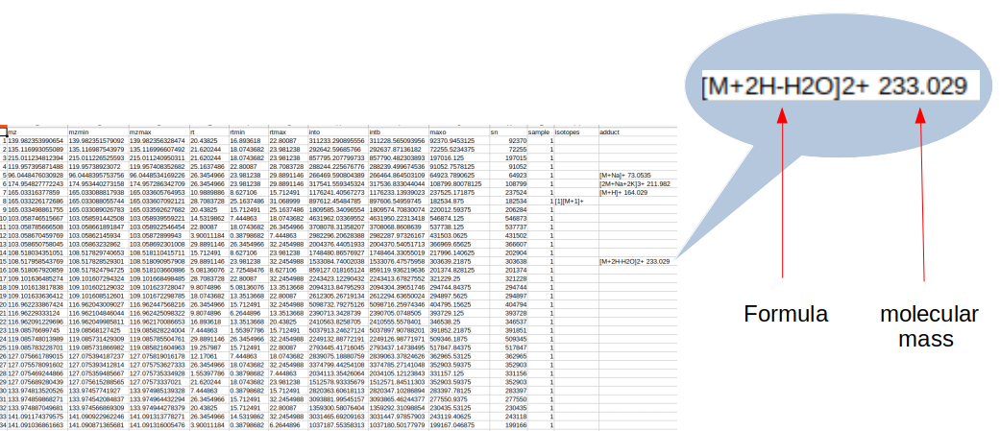

# Metabolomics_to_Single_Cell
## Introduction
Here is a experimental pipeline, to help biologist understand samples from 2 different view. The goal is to validate or invalidate single cell RNA seq conclusion with metabolomics data. Let's say you have extract RNA from patient sample and you now have raw data. A first step is to analyzeyoure data, and you can go here for that purpose : https://github.com/Nathan-bioinfo/SingR. This is an shiny R application that i have develloped and it will help you to find particular RNA, or biological pathways involved in youre study. The next step could be a metabolomic confirmation, to double check the results and maybe get additional informations. 
## Data
The demonstration is based on .mzml files, raw data from LC-HRMS Thermo Q-Exactive (Liquid Chromatography for Mass Spectrometry), but if you are lucky and you have a metbolite list, you can jump to FELLA part. 
It is very important to remind that the method we will explain here only gives ideas of real metabolites. It's based on m/z and retetntion time, but with a lot of inference and prediction. You will probably obtain a metabolite list with our pipeline, but keep in mind these are prediction, maybe some annotations are accurate, but these are not 100% sure results. As biologist, we have tried to do annotation job for metabolites, but for a reaaly accurate job, you will need chimist ability.  
## Inference on molecular mass
CAMERA is an R package for metabolites annotation : https://www.bioconductor.org/packages/devel/bioc/vignettes/CAMERA/inst/doc/CAMERA.pdf  
You will find the R code in the CAMERA_pipe.R file. If everything went well with the code, you chould obtain a csv file :   
The last columns contains the graal you need for the following steps: molecular mass of the molecules. It's not surprising if all lines are not filled, because there are multiple similar molecules, and some molecules the programm have not find information.
## Comparing mass to public database metabolites
This is the tricky part, and the most questionable. The theory is that every molecule have it's own molecular mass. If we have acess to database that contains molecule names AND molecular mass, it's easy to compare those mass with the one we infer before with CAMERA. In a perfect world, 2 identical masses should be describe the same molecule. But reality is more complicated and some times, a molecular mass will hit with dozens of molecules. Let's accept the weaknesses of this method and still try to convert masses to names. You will find a python script name mass_comparison.py. Please download and run it on youre machine. Please remind to change the path to youre corresponding files (in line 3 for the csv you have created with CAMERA and in line 13 for the reference file you want to use

